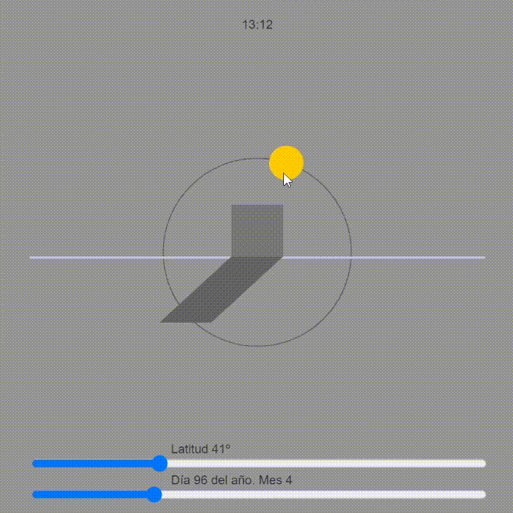

# Shadows
This is **shadows simulator** developed with *p5.js* in *JavaScript* to the Sun's movement in the sky and the shadow cast by a building.

## Sample

## Parameters
Using the sliders parameters can be changed: 
- Time
- Latitude
- Day of the year
